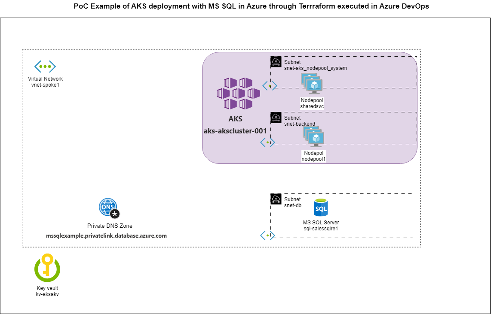

## PoC Example of AKS deployment with MS SQL in Azure through Terrraform executed in Azure DevOps

# Introduction 
Azure DevOps pipeline for Terraform deployment/destroy of environment based on AKS and MS SQL with usage of terraform-azurerm-caf modules

# Getting Started

1.	Prerequisites
2.	Deployment process
3.	Testing
4.	Destroy process
# Diagram of deployement

# 1. Prerequisites
1. Azure Subscription
    Owner Service Principal Created( Service Connection for Azure DevOps)
2. SA for TFSTATE file
    Public accesible storage account with Blob Container created
    (preferably created by LZ launchpad) [:books: Azure Terraform Landing zones](https://aka.ms/caf/terraform)
3. Azure DevOps Organization
    Service Connection enabled from Azure Subscription
    Default Environment Setup in Pipelines

# 2. Deployment process
1. Map Terraform_Deploy.yaml as pipelines inside the Azure DevOps pipeline
2. Verify variables in variables.yml with configuration in Azure
3. Verify TF configuration in Default/DEMO_APPAKS_DEV
    (Example is based on on CAF examples: https://github.com/aztfmod/terraform-azurerm-caf/tree/5.7.3/examples/compute/kubernetes_services/104-private-cluster and https://github.com/aztfmod/terraform-azurerm-caf/tree/5.7.3/examples/mssql_server/111-sqlserver_private_endpoint )
4. Run pipeline, verify the plan and approve apply stage, if changes are valid

# 3. Testing
(Simple approach through Azure Cloud Shell)
1. Select subscription of deployment
    az account set --subscription <>
2. Fetch credentials
    az aks get-credentials --resource-group <<rgname> --name <<clustername>>
3. Run pod with MSSQL tools
    kubectl run -it mssql --image mcr.microsoft.com/mssql-tools
4. Execute connection to SQL in pod 
    sqlcmd -S <<nameofserver>>.mssqlexample.privatelink.database.azure.com -U <<username>> -P '<<password from kv>>'
Example: 
    sqlcmd -S sql-salessqlre1.mssqlexample.privatelink.database.azure.com -U sqlsalesadmin -P 'qwerjakuhgrkjdsagfds54dfs51f23s1z'

# 4. Destroy process
1. Map Terraform_Destroy.yaml as pipelines inside the Azure DevOps pipeline
2. Verify variables in variables.yml with configuration in Azure
3. Verify TF configuration in Default/DEMO_APPAKS_DEV
    (Example is based on on CAF examples: https://github.com/aztfmod/terraform-azurerm-caf/tree/5.7.3/examples/compute/kubernetes_services/104-private-cluster and https://github.com/aztfmod/terraform-azurerm-caf/tree/5.7.3/examples/mssql_server/111-sqlserver_private_endpoint )
4. Run pipeline, verify the plan and approve apply stage, if changes are valid

# Support
This example is just POC solution, nothing to be expected to be maintaned in the state expressed in this repo.

# References

[Cloud Adoption Framework for Azure](https://aka.ms/caf) 

[CAF on GitHub](https://github.com/aztfmod/terraform-azurerm-caf)

[CAF: Example AKS: 104-private-cluster](https://github.com/aztfmod/terraform-azurerm-caf/tree/5.7.3/examples/compute/kubernetes_services/104-private-cluster)

[CAF: Example AKS: 111-sqlserver_private_endpoint](https://github.com/aztfmod/terraform-azurerm-caf/tree/5.7.3/examples/mssql_server/111-sqlserver_private_endpoint) 